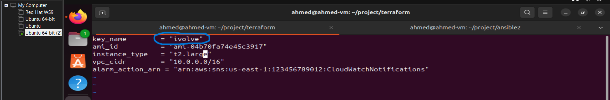

# Ivolve Final project
__-__-__-__-__-__

# MultiCloudDevOpsProject
This final project is about how to deploy an application to openshift cluster using deffirint tools
In this project i use many tools such as: - Docker for contranitaziton and use some another tools as a container 
                                          - Ansible used for run ansible roles and manage configuration " used it in two deffirint ways "
                                          - Jenkins used for CI/CD "use it as a container or installed on localhost "
                                          - Terraform used for Infrastructure provisioning
                                          - OpenShift to deploy the application
                                          - SonaQube for code Quality test

## Project Diagram


## Project Structure
```bash
├── ansible
│   ├── ansible.cfg
│   ├── docker
│   │   ├── defaults
│   │   │   └── main.yml
│   │   ├── files
│   │   ├── handlers
│   │   │   └── main.yml
│   │   ├── meta
│   │   │   └── main.yml
│   │   ├── README.md
│   │   ├── tasks
│   │   │   └── main.yml
│   │   ├── templates
│   │   ├── tests
│   │   │   ├── inventory
│   │   │   └── test.yml
│   │   └── vars
│   │       └── main.yml
│   ├── inventory
│   ├── ivolve.pem
│   ├── jenkins
│   │   ├── defaults
│   │   │   └── main.yml
│   │   ├── files
│   │   ├── handlers
│   │   │   └── main.yml
│   │   ├── meta
│   │   │   └── main.yml
│   │   ├── README.md
│   │   ├── tasks
│   │   │   └── main.yml
│   │   ├── templates
│   │   ├── tests
│   │   │   ├── inventory
│   │   │   └── test.yml
│   │   └── vars
│   │       └── main.yml
│   ├── jenkins_user
│   │   ├── 2q
│   │   ├── defaults
│   │   │   └── main.yml
│   │   ├── files
│   │   ├── handlers
│   │   │   └── main.yml
│   │   ├── meta
│   │   │   └── main.yml
│   │   ├── README.md
│   │   ├── tasks
│   │   │   └── main.yml
│   │   ├── templates
│   │   ├── tests
│   │   │   ├── inventory
│   │   │   └── test.yml
│   │   └── vars
│   │       └── main.yml
│   ├── oc
│   │   ├── defaults
│   │   │   └── main.yml
│   │   ├── files
│   │   ├── handlers
│   │   │   └── main.yml
│   │   ├── meta
│   │   │   └── main.yml
│   │   ├── README.md
│   │   ├── tasks
│   │   │   └── main.yml
│   │   ├── templates
│   │   ├── tests
│   │   │   ├── inventory
│   │   │   └── test.yml
│   │   └── vars
│   │       └── main.yml
│   ├── playbook.yml
│   ├── sonar
│       ├── compose
│       │   └── compose.yaml
│       ├── defaults
│       │   └── main.yml
│       ├── files
│       ├── handlers
│       │   └── main.yml
│       ├── meta
│       │   └── main.yml
│       ├── README.md
│       ├── tasks
│       │   └── main.yml
│       ├── templates
│       ├── tests
│       │   ├── inventory
│       │   └── test.yml
│       └── vars
│           └── main.yml

├── ansible2
│   ├── ansible.cfg
│   ├── docker
│   │   ├── defaults
│   │   │   └── main.yml
│   │   ├── files
│   │   ├── handlers
│   │   │   └── main.yml
│   │   ├── meta
│   │   │   └── main.yml
│   │   ├── README.md
│   │   ├── tasks
│   │   │   └── main.yml
│   │   ├── templates
│   │   ├── tests
│   │   │   ├── inventory
│   │   │   └── test.yml
│   │   └── vars
│   │       └── main.yml
│   ├── git
│   │   ├── defaults
│   │   │   └── main.yml
│   │   ├── files
│   │   ├── handlers
│   │   │   └── main.yml
│   │   ├── meta
│   │   │   └── main.yml
│   │   ├── README.md
│   │   ├── tasks
│   │   │   └── main.yml
│   │   ├── templates
│   │   ├── tests
│   │   │   ├── inventory
│   │   │   └── test.yml
│   │   └── vars
│   │       └── main.yml
│   ├── inventory
│   ├── ivolve.pem
│   ├── jenkins
│   │   ├── defaults
│   │   │   └── main.yml
│   │   ├── files
│   │   ├── handlers
│   │   │   └── main.yml
│   │   ├── meta
│   │   │   └── main.yml
│   │   ├── README.md
│   │   ├── tasks
│   │   │   └── main.yml
│   │   ├── templates
│   │   ├── tests
│   │   │   ├── inventory
│   │   │   └── test.yml
│   │   └── vars
│   │       └── main.yml
│   ├── openshift
│   │   ├── defaults
│   │   │   └── main.yml
│   │   ├── files
│   │   ├── handlers
│   │   │   └── main.yml
│   │   ├── meta
│   │   │   └── main.yml
│   │   ├── README.md
│   │   ├── tasks
│   │   │   └── main.yml
│   │   ├── templates
│   │   ├── tests
│   │   │   ├── inventory
│   │   │   └── test.yml
│   │   └── vars
│   │       └── main.yml
│   ├── playbook.yml
│   └── sonarqube
│       ├── defaults
│       │   └── main.yml
│       ├── files
│       ├── handlers
│       │   └── main.yml
│       ├── meta
│       │   └── main.yml
│       ├── README.md
│       ├── tasks
│       │   └── main.yml
│       ├── templates
│       ├── tests
│       │   ├── inventory
│       │   └── test.yml
│       └── vars
│           └── main.yml
├── build.gradle
├── Dockerfile
├── gradle
│   └── wrapper
│       ├── gradle-wrapper.jar
│       └── gradle-wrapper.properties
├── gradlew
├── gradlew.bat
├── jenkinsfile
├── openshift
│   ├── deploy.yml
│   ├── route.yml
│   └── service.yml
└── terraform
    ├── main.tf
    ├── modules
    │   ├── cloudwatch-sns
    │   │   ├── main.tf
    │   │   └── variables.tf
    │   ├── ec2
    │   │   ├── main.tf
    │   │   ├── outputs.tf
    │   │   └── variables.tf
    │   ├── security-groups
    │   │   ├── main.tf
    │   │   ├── outputs.tf
    │   │   └── variables.tf
    │   └── vpc
    │       ├── main.tf
    │       ├── outputs.tf
    │       └── variables.tf
    ├── output.tf
    ├── terraform.tfstate
    ├── terraform.tfstate.backup
    ├── terraform.tfvars
    └── variables.tf
```

# First stage 

## Terraform

Terraform is a powerful tool used for infrastructure provisioning and management. It allows developers and operators to define infrastructure as code (IaC), using a declarative configuration language. With Terraform, you can describe the components of your cloud infrastructure (like servers, databases, and networking) in configuration files. Terraform then automatically manages the lifecycle of these resources, provisioning and configuring them as needed to match the desired state defined in your code. This approach improves reproducibility, consistency, and efficiency in managing infrastructure across different cloud providers and environments.

- **Step 1: Terraform Initialization**:
  - Initializes Terraform to set up the environment and modules required for deployment.
  - Ensures Terraform plugins are installed and initializes backend configurations.

   

- **Step 2: Terraform plan**:
"The `terraform plan` command in Terraform generates and displays an execution plan. It analyzes the current state of infrastructure defined in your Terraform configuration files (`*.tf`) and compares it with the desired state. The output outlines the actions Terraform will perform: creating, modifying, or deleting resources, along with any associated attributes changes. Importantly, `terraform plan` only previews these changes without applying them, allowing users to review and validate proposed modifications before execution."

- **Step 3: Terraform Apply**:
 - used to apply all changes in terraform configuration files 

    
    
    ##########################################

    


- **Stage 5: Terraform output**:

Terraform output files define values that are displayed post-deployment, like IP addresses or URLs. They're defined in `outputs.tf`, using `output` blocks with unique names and expressions. Accessed via `terraform output`, they facilitate integration and automation by sharing deployment details across infrastructures.


  - Usea terraform output cinfiguration file to get the ip of AWS EC2 to use it in ansible inventory for applying ansible tasks
    and also get another information such as : - subnets IPs
                                               - VPC ID


**The result of terraform from AWS management console**

1. VPC with IP "10.0.0.0/16"


2. supnets 'public , private'


3. Route tables 


4. Internet geteway 


5. EC2


6. CloudWatch


7. Alarms


8. SNS & SNS subscribtion


 


__-__ __-__ __-__ __-__ __-__ __-__ __-__ __-__


# Socend stage 
## Ansible

Ansible is an open-source automation tool used for configuration management, application deployment, and task automation. It simplifies IT operations by allowing users to automate repetitive tasks through declarative YAML-based playbooks. Ansible uses SSH to communicate with remote nodes and does not require any agents to be installed on them, making it lightweight and easy to set up. Its modular design and extensive community support make it a popular choice for managing infrastructure as code and orchestrating complex IT workflows efficiently.

**Resources: https://docs.ansible.com/**

**in this stage i take to ways**

### First way "continarization"

Containers, particularly through technologies like Docker, revolutionize software development and deployment by encapsulating applications and their dependencies into lightweight, portable units. These containers include everything needed to run an application: code, runtime, system tools, libraries, and settings. Here's a brief overview of how containers, such as Docker containers, manage and limit resources on a localhost:

1. **Resource Isolation**: Containers utilize Linux kernel features like namespaces and cgroups to provide isolated environments for applications. Each container operates as if it has its own dedicated resources, such as network interfaces, file systems, and process trees. This isolation prevents applications from interfering with each other and provides a level of security by limiting what each container can access.

2. **Resource Allocation**: Docker containers allow developers to specify resource limits for each container instance. These limits can include CPU shares, memory usage, disk I/O, and network bandwidth. By setting these constraints, developers can ensure that no single container monopolizes resources, leading to a more stable and predictable environment.

3. **Efficient Resource Utilization**: Containers optimize resource usage by sharing the host operating system's kernel. Unlike virtual machines (VMs), which require their own operating system instance, containers leverage the host OS's kernel, making them lightweight and efficient. This efficiency means more containers can run on the same host without significant performance degradation, thus maximizing resource utilization.

4. **Portability and Consistency**: Containers ensure consistency across different environments, from development to production. Since each container encapsulates its dependencies and configuration, applications behave consistently regardless of where they run. This portability simplifies deployment workflows and reduces the likelihood of issues arising from differences between development and production environments.

In summary, containers like Docker provide a standardized, efficient way to package, deploy, and manage applications while limiting resource usage on a localhost through isolation and resource allocation mechanisms. This approach not only enhances scalability and efficiency but also improves developer productivity by streamlining the deployment process.

### Steps

in this way we fucas to use ansible roles,

**what is ansible roles**

Ansible roles are modular units that organize tasks, configurations, and files into reusable packages. They enhance playbook organization, promote code reuse across projects, and simplify managing complex automation tasks by encapsulating functionality in a structured directory format. Roles enable efficient collaboration, inheritance of configurations, and consistent automation across environments, contributing to scalable and maintainable Ansible deployments.

##### 1- intialize ansible roles 

**to install Docker and all it's dependencies**
Tasks:
```
vim ~/project/ansible2/docker/tasks/main.yml
```
1. Update apt packages
2. Gither destribuation information
3. Install all  Docker Prerequsites 
4. Add Docker GPG Key
5. Add Docker repository
6. Install Docker
7. Start and Enable Docker service
8. Change the permation for /var/run/docker.sock

#####################################################

**to install jenkins and all it's dependencies**
Tsaks:
```
vim ~/project/ansible2/jenkins/tasks/main.yml
```
1. Pull jenkins image
2. Create jenkins container
3. Fetch jenkins Password
4. Install Java 17 for jenkins conatainer
5. Install Docker Cli inside jenkins conatiner

########################################################

**to install git inside jenkins conatiner**
Tasks:
```
vim ~/project/ansible2/git/tasks/main.yml
```
1. Update apt Cash
2. Install Git
##########################################################
**to install OpenShift inside jenkins conatiner**
Tasks:
```
vim ~/project/ansible2/openshift/tasks/main.yml
```
1. Install oc cli on the localhost
2. Copy oc cli to jenkins container
3. Extract oc cli tallbar inside jenkins container
4. Ensure that oc cli is executable inside jenkins container

###########################################################

**to itiate sonarqube server**
- What is sonarQube ?

SonarQube is an open-source platform designed to continuously inspect code quality throughout the software development lifecycle. It provides a comprehensive range of static code analysis tools to identify bugs, security vulnerabilities, code smells, and enforce coding standards across multiple programming languages.

Key features of SonarQube include:

1. **Static Code Analysis**: It scans codebases to detect issues early in the development process, helping teams maintain clean, reliable code.

2. **Code Quality Metrics**: SonarQube calculates various metrics such as code coverage, complexity, duplications, and maintainability to assess overall code health.

3. **Security Vulnerability Detection**: It identifies potential security vulnerabilities in code, such as SQL injection, XSS, and other common vulnerabilities.

4. **Integration with CI/CD**: SonarQube integrates seamlessly with Continuous Integration (CI) and Continuous Deployment (CD) pipelines, enabling automated code analysis and quality checks as part of the build process.

5. **Customizable Rules and Profiles**: Teams can tailor SonarQube's analysis rules and quality profiles to fit specific project requirements and coding standards.

6. **Historical Reporting and Trends**: It provides historical data and trend analysis, allowing teams to track improvements in code quality over time and prioritize technical debt reduction.

Overall, SonarQube is widely used in software development teams to ensure code reliability, security, and maintainability by catching issues early and fostering continuous improvement in code quality.


**Resources: https://docs.sonarsource.com/sonarqube/latest/**

Tasks:
```
vim ~/project/ansible2/sonaqube/tasks/main.yml
```
1. Create Docker volumes for sonarqube
2. Pull PostgreSQL image
3. Run PostgreSQL container
4. Pull SonarQube image
5. Run SonarQube container

##############################################

##### 2- get the SSH Key that attached to EC2
- get the SSH Key for EC2 to enable ansible to connect to EC2 Via SSH

  
  

- and note to call the SSH key path on "ansible.cfg" file 

.png>)

##### 3- Run ansible playbook


```sh
ansible-playbook -i inventory playbook
```
-3.png)


__-__ __-__ __-__ __-__ __-__ __-__ __-__ __-__ __-__

### Second way "Install on local machine"

In This way I install every thing on the local machine "but it need more resources"

I will install the same package " 'Docker' , 'Jenkins' , 'git' , 'openshify' "

create SonarQube as a docker compose 

  

###############################################
### steps

##### 1- Intiate ansible roles
**install docker and its pre-requistes**
Tasks:
```
vim ~/project/ansible/docker/tasks/main.yml
```
The Same tasks for the first way

##############################################

**install jenkins on localhost**
Tasks:
```
vim ~/project/ansible/jenkins/tasks/main.yml
```
1. Install Java 
2. install openJDK 17
3. Download jenkins repository key
4. Add jenkins to repository
5. Install jenkins 
6. start jenkins service

#############################################

**Configure jenkins and create user**
Tasks:
```
vim ~/project/ansible/jenkins_user/tasks/main.yml
```
1. Add jenkins Password
2. Create CRUMB authentication request
3. Add jenkins administration account
4. Install jenkins plugns
5. DAEMON reload 
6. restart jenkins service

############################################

**install OpenShift CLI**
Tasks:
```
vim ~/project/ansible/oc/tasks/main.yml
```
1. Install oc cli
2. Extract OpenShift CLI
3. verify installation

###########################################

**install and configure SonarQube**
Tasks:
```
vim ~/project/ansible/sonarqube/tasks/main.yml
```
Create Docker compuse to run sonarqube
1. Copy docker compuse to the managed host 
2. Set sysctl and ulimit settings for ElasticSearch
3. Ensure compose.yml file exists
4. Change permissions of compose.yml file 
5. Run Docker Compose
```sh
docker compose -f /home/ubuntu/compose.yaml up -d
```
###########################################

##### 2- get the SSH Key that attached to EC2
- get the SSH Key for EC2 to enable ansible to connect to EC2 Via SSH

###########################################

##### 3- Run Ansible playbook

-1.png)
-2.png)
-3.png)
-4.png)
-5.png) 

__-__ __-__ __-__ __-__ __-__ __-__ __-__ __-__ __-__

# Third Stage
## OpenShift

**What is OpenShift Cluster**

An OpenShift cluster is a scalable, container-centric platform built on Kubernetes that enables organizations to deploy, manage, and orchestrate containerized applications. It consists of a collection of nodes (servers) that work together to provide a unified platform for running applications. 

Key components of an OpenShift cluster include:

1. **Master Nodes:** Control plane components that manage and coordinate the cluster. They include API server, scheduler, controller manager, and etcd (a distributed key-value store for cluster data).

2. **Worker Nodes:** Also known as compute nodes, these run the containerized applications using Kubernetes pods. They host the application containers and necessary services like networking and storage.

3. **Networking:** OpenShift uses software-defined networking to enable communication between pods and services within the cluster and with external networks.

4. **Storage:** Provides persistent storage solutions for applications, allowing data to persist beyond the lifespan of individual containers.

5. **Operators:** Automation controllers that extend Kubernetes to manage complex, stateful applications on behalf of the user, ensuring easier management of applications running in the cluster.

6. **Console and CLI:** Provides graphical and command-line interfaces for developers and administrators to interact with and manage the cluster, monitor resources, deploy applications, and configure services.

OpenShift clusters support high availability configurations, allowing for redundancy and fault tolerance across nodes and components. They are designed to simplify the deployment and management of containerized applications at scale, offering features for application lifecycle management, security, and integration with CI/CD pipelines.


**Resources: https://docs.openshift.com/**

_____________________________________________________
_____________________________________________________

we need to create a Deployment file to apply create a deployment with four replacis 


And Then Expose this deployment and get the service  with port 8080


Then create a route to make the application accessable from the internet


__-__ __-__ __-__ __-__ __-__ __-__ __-__ __-__

# Fifth Stage
## SonarQube

Create a SonarQube server for Code Quality test
AS we show before that in ansible 1 we create the SonarQube as a Docker compuse 


or create it a Container

in these two case we access SonarQube VIA port 9000


Then Create a local project


And then create a token for this sonar project from administration security


__-__ __-__ __-__ __-__ __-__ __-__ __-__ __-__

# VI Stage
## GitHub

##### 1- Clone the App using this command
```bash
git clone https://github.com/EngMohamedElEmam/spring-boot-app.git
```

##### 2- push to your new repo in a dev branch 
```bash
git init 
git add *  
git commit -m "push the app"
git branch -M main
git remote add origin git@github.com:ahmedmostafa56389/MultiCloudDevOpsProject.git
git push -u origin dev
```
dev Branch: Used for development work.


 


##### 3- Shared library 
Certainly! A shared library in Jenkins allows you to define and maintain a set of reusable Groovy scripts that can be referenced from Jenkins pipelines. This promotes code reuse, simplifies pipeline definitions, and ensures consistency across jobs. Shared libraries can encapsulate complex logic, common functions, or integrations, making them a powerful tool for managing and scaling Jenkins pipelines efficiently.

**Resources: https://www.jenkins.io/doc/**


I create somee Groovy scripts:
1. test the code 
2. for run sonarqube server and test the code quality
3. build docker image
4. push docker image to dockerhub
5. change image name in deployment file
6. Apply Openshift files on openshift cluster

'Then we use and define these Groovy scripts'

##### 4- create Jenkins file 

- Define the shared library 
- Define some environment variables ('Dockerhub credintial , openshift credintial , openshift project , cluster url , sonarqube tool').
- Define the file stages 
- Create post to print statments on all possible conditions ('success , failure')

Explanation:
pipeline: Defines the entire Jenkins Pipeline.
agent any: Executes the pipeline on any available agent.
environment: Sets the BUILD_VERSION environment variable.
stages: Contains stages (Build, Test, Deploy) that run sequentially.
steps: Commands (echo for messaging, sh for shell commands) executed within each stage.
post: Defines actions (success and failure) to execute after all stages complete.
This streamlined version retains essential pipeline structure and functionality while being more concise. Adjust the commands and conditions as needed for your specific build and deployment processes.

__-__ __-__ __-__ __-__ __-__ __-__ __-__ __-__

# Fifth Stage 
## Jenkins and its configuration

##### 1- credintials

After Run ansible roles and install jenkins on localhost or use it as a container 
we can access jenkins from port '8080' after the host IP

Then we start to enter our credintials that need to use on our project 

**Github credintials**
- using mail and password


**DockerHub credintials**
- Also using mail and password


**Openshift credintials**
- We must create a service account on our openshift cluster to use it in deploying process and give it the admin roles
```sh
oc create sa ahmed-project
oc policy add-role-to-user admin system:serviceaccount:ahmedmostata:ahmed-project
```

In OpenShift, a service account is a dedicated identity assigned to an application or process within the Kubernetes cluster. It allows the application to authenticate with and access various resources securely, without requiring human intervention or sharing sensitive credentials. Service accounts are crucial for implementing the principle of least privilege, as they can be configured with specific roles and permissions tailored to the application's needs. This isolation helps enhance security by limiting the scope of access to only what is necessary for the application to function, ensuring a more controlled and secure deployment environment within OpenShift.

Then we need to get this account 'TOKEN' to give it to Jenkins to make this account accessable 
```sh
oc sa get-token ahmed-project
```
Then cope this token and create a 'secret text' credintial in jenkins


##### 2. Define sherd library repository 
From System of jenkins define Trused Shared library with the same name in jenkins file


Then put the link of shared library repository and finish the configuratio


##### 3. Define the sonarqube tool and plugin

From Tools scroll down to sonarqube scanner installation and configure it


Back and From Plugins choose available then search for sonaqube and install it


And From System scroll down to sonarqube servers and configure one with sonarqube name , url and credintials


##### 4. Cresate pipeline 

Create pipeline with name 'MultiCloudDevOpsProject'


Then Run the Pipleline 


__-__ __-__ __-__ __-__ __-__ __-__ __-__ __-__

# Verifying
After jenkins pipeline run successfully we can verfiy that our app had been deployed successfuly from our openshift cluster 

we can see these:

- our Deployment 


- Pods 


- service


- Route


Finally Our Application


